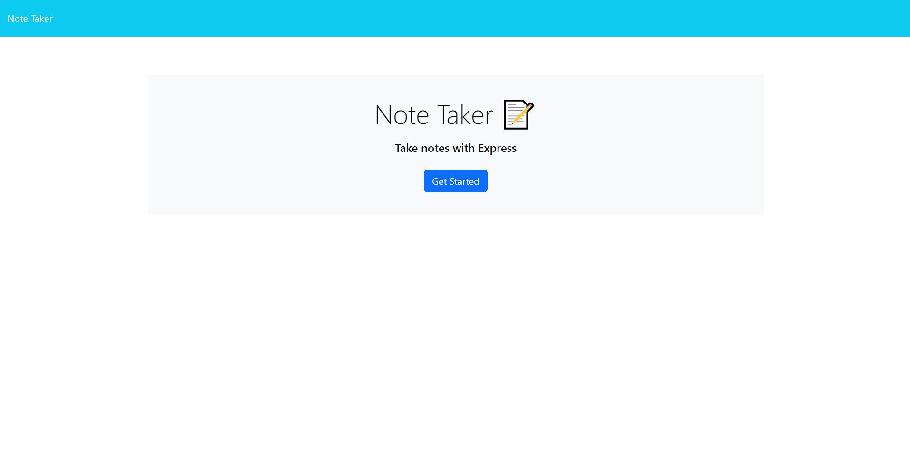
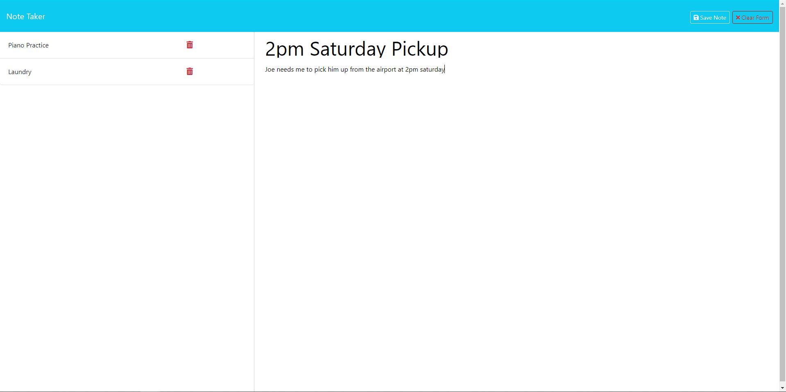

# Evan's Note Taker []

A heroku application that allows user to create and delete notes.

## Table of Contents

[Installation](#installation)

[Usage](#usage)

[Credits](#credits)

[License](#license)

## Example Images

## Installation

N/A

## Usage

1. Start by clicking on the "Get Started" button on the home screen.
2. This will take you to the notes page, where you can create and manage your notes.
3. To create a new note, simply add a title and text.
4. If you want to clear the note before saving, you can use the "Clear Form" button in the top right corner.
5. Once you've added a title and text, a "Save Note" button will appear in the top right corner as well.
6. The note will be saved internally, and its title will be displayed on the left side of the page.
7. To view the content of a saved note, click on its title. The note will be displayed in a read-only format.

## Credits

Evan Keller
Helper functions in fileSystem.js initially taken from solved mini project, before being modified.

## License

This application is using the MIT license.
